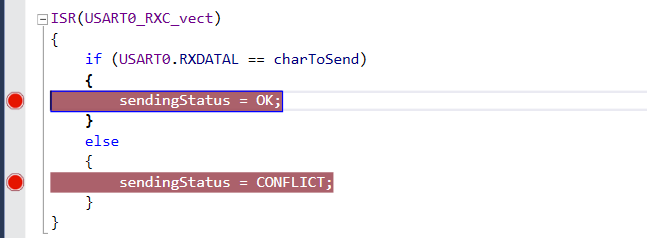
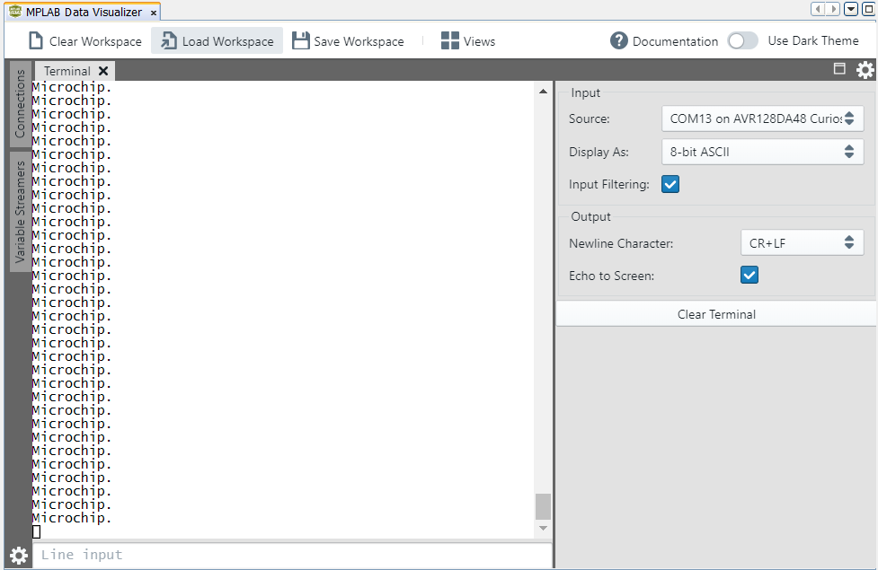

<!-- Please do not change this logo with link -->

# One-Wire Mode

This project shows how to configure the USART peripheral in One-Wire mode and send a string through it.
One-Wire mode refers to using a single for both transmitting and receiving. The pin is changed to output when transmitting, while it is input the rest of the time to listen to new messages. The code will send the string "Microchip.\r\n" every 500 ms.  

## Related Documentation

More details and code examples on the AVR128DA48 can be found at the following links:

- [TB3216-Getting Started with Universal Synchronous/Asynchronours Receiver/Transmitter (USART)](https://www.microchip.com/)
- [AVR128DA48 Product Page](https://www.microchip.com/wwwproducts/en/AVR128DA28)
- [AVR128DA48 Code Examples on GitHub](https://github.com/microchip-pic-avr-examples?q=avr128da48)
- [AVR128DA48 Project Examples in START](https://start.atmel.com/#examples/AVR128DA48CuriosityNano)

## Software Used

- MPLAB® X IDE 5.40 or newer [(microchip.com/mplab/mplab-x-ide)](http://www.microchip.com/mplab/mplab-x-ide)
- MPLAB® XC8 2.30 or a newer compiler [(microchip.com/mplab/compilers)](http://www.microchip.com/mplab/compilers)
- MPLAB® Code Configurator (MCC) 4.0.1 or newer [(microchip.com/mplab/mplab-code-configurator)](https://www.microchip.com/mplab/mplab-code-configurator)
- MPLAB® Code Configurator (MCC) Device Libraries 8-bit AVR MCUs 2.5.0 or newer [(microchip.com/mplab/mplab-code-configurator)](https://www.microchip.com/mplab/mplab-code-configurator)
- AVR-Dx 1.4.75 or newer Device Pack

## Hardware Used

- AVR128DA48 Curiosity Nano [(DM164151)](https://www.microchip.com/Developmenttools/ProductDetails/DM164151)

## Setup

The AVR128DA48 Curiosity Nano Development Board is used as test platform.

 

The following configurations must be made for this project:

System clock: 3.33 MHz

USART1 is configured for 9600 baud, with receive and transmit enabled, loop back mode enabled and 8N1.

|    Pin    | Configuration  |
| :-------: | :------------: |
| PC0 (TX)  | Digital input  |

- The TX pin will switch between input and output depending if the device is sending data or not, but it starts as input.
  

## Operation

1.  Connect the board to the PC.

2.  Open the One_Wire_Mode.X project in MPLAB X.

3.  Set the One_Wire_Mode.X project as main project. Right click on the project in the **Projects** tab and click **Set as Main Project**.

 

4.  Clean and build the One_Wire_Mode.X project: right click on the **One_Wire_Mode.X** project and select **Clean and Build**.

 

5.  Select **AVR128DA48 Curiosity Nano** in the Connected Hardware Tool section of the project settings:

- Right click on the project and click **Properties**;
- Click the arrow right next to Connected Hardware Tool;
- Select AVR128DA48 Curiosity Nano (click on the **SN**), click **Apply** and then click **OK**:

 

6.  Program the project to the board: right click the project and click **Make and Program Device**.

 

7. Enable two breakpoints, as presented in the image below, and click **Continue**.

 

Demo:

 

The picture shows the device sending the string "Microchip.\r\n".

## Summary

This project shows how to send a string through USART configured in One-Wire mode. 
