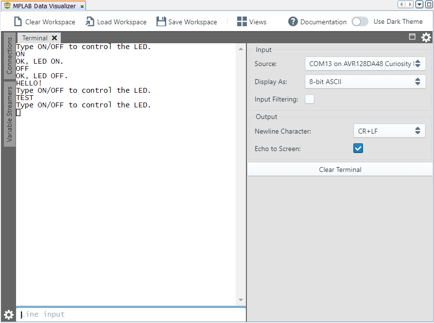

<!-- Please do not change this logo with link -->

# Receive Control Commands

This project shows how to use the USART to implement a command-line interface. This way, the microcontroller can receive control commands via the USART. It is convenient to use the line terminator as a command delimiter, so for this use case the USART will read full lines. The application can decode:
- **"ON"** command which turns on an LED and replies with **"OK, LED ON."**
- **"OFF"** command which turns off an LED and replies with **"OK, LED OFF."**
- for anything else it replies with **"Incorrect command."**

## Related Documentation

More details and code examples on the AVR128DA48 can be found at the following links:

- [TB3216-Getting Started with Universal Synchronous/Asynchronours Receiver/Transmitter (USART)](https://www.microchip.com/)
- [AVR128DA48 Product Page](https://www.microchip.com/wwwproducts/en/AVR128DA28)
- [AVR128DA48 Code Examples on GitHub](https://github.com/microchip-pic-avr-examples?q=avr128da48)
- [AVR128DA48 Project Examples in START](https://start.atmel.com/#examples/AVR128DA48CuriosityNano)

## Software Used

- MPLAB® X IDE 5.40 or newer [(microchip.com/mplab/mplab-x-ide)](http://www.microchip.com/mplab/mplab-x-ide)
- MPLAB® XC8 2.30 or a newer compiler [(microchip.com/mplab/compilers)](http://www.microchip.com/mplab/compilers)
- MPLAB® Code Configurator (MCC) 4.0.1 or newer [(microchip.com/mplab/mplab-code-configurator)](https://www.microchip.com/mplab/mplab-code-configurator)
- MPLAB® Code Configurator (MCC) Device Libraries 8-bit AVR MCUs 2.5.0 or newer [(microchip.com/mplab/mplab-code-configurator)](https://www.microchip.com/mplab/mplab-code-configurator)
- AVR-Dx 1.4.75 or newer Device Pack

## Hardware Used

- AVR128DA48 Curiosity Nano [(DM164151)](https://www.microchip.com/Developmenttools/ProductDetails/DM164151)

## Setup

The AVR128DA48 Curiosity Nano Development Board is used as test platform.

 

The following configurations must be made for this project:

System clock: 3.33 MHz

USART1 is configured for 9600 baud, transmit and receive enabled, 8N1.

Pin PC6 is named LED and configured as digital output.

|    Pin    | Configuration  |
| :-------: | :------------: |
| PC0 (TX)  | Digital output |
| PC1 (RX)  | Digital input  |
| PC6 (LED) | Digital output |

## Operation

1.  Connect the board to the PC.

2.  Open the Receive_Control_Commands.X project in MPLAB® X.

3.  Set the Receive_Control_Commands.X project as main project. Right click the project under the **Projects** tab and click **Set as Main Project**.

 

4.  Clean and build the Receive_Control_Commands.X project: right click the **Receive_Control_Commands.X** project and select **Clean and Build**.

 

5.  Select **AVR128DA48 Curiosity Nano** in the Connected Hardware Tool section of the project settings:

- Right click the project and click **Properties**;
- Click on the arrow right next to Connected Hardware Tool;
- Select AVR128DA48 Curiosity Nano (click the **SN**), click **Apply** and then click **OK**:

 

6.  Program the project to the board: right click the project and click **Make and Program Device**.

 

Demo:

 

In the above figure, the two commands are sent and the reply of the microcontroller can be seen. Additionally, an incorrect command is sent to show the way the microcontroller responds. 
 

## Summary
This project shows how to receive specific commands over USART, execute the commands and provide the state of the application back.
